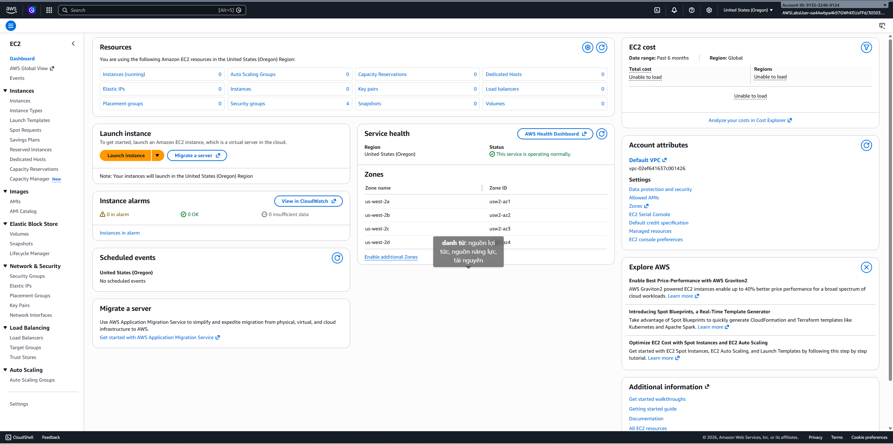

# EC2-S3-CLOUDFRONT-LAMBDA- API-

# **Introduction to Amazon EC2**

Task 1 :  Khởi chạy EC2

- Đăng nhập vào AWS management, tìm kiếm EC2 trong thanh tìm kiếm
- Chọn EC2



- Chọn Launch Instance để khởi tạo chương trình
- Name and tags , nhập : Web Server
- Chọn hệ điều hành **Amazon Linux 2023 AMI**.
- Instance Type chọn t3.micro


- Key pair chọn Proceed without a key pair
- Trong phần networking settings nhấn edit
    - VPC required chọn Lab VPC
    - Subnet chọn public subnet 1
- Trong phần Firewall chọn select existing security group:
    - Common security group chọn Web Server security group
- Các lựa chọn của configure storage thì để mặc định


- Tới phần Advanced details chọn xổ xuống để mở rộng thêm thông tin :
    - Ở phần termination protection chọn enable
    - Cuộn tiếp xuống phần user data - optional copy và paste đoạn code này vào :
        - #!/bin/bash
        dnf -y install httpd
        systemctl enable httpd
        systemctl start httpd
        echo '<html><h1>Hello From Your Web Server!</h1></html>' > /var/www/html/index.html
    - Sau khi làm xong thì chọn Launch instance


- Sau khi bấm xong sẽ hiện màn success


- Về lại màn instance sẽ hiện thanh running:


Task 2: Giám sát

- Chọn status and alarms


- Chọn xem trang monitoring và bấm action chọn monitor and troubleshoot để kiểm tra get system log (Dùng để kiểm tra quá trình khởi động và xác nhận script User Data đã chạy thành công)


- Tiếp tục chọn get instance screenshot


Task 3: Cập nhật nhóm bảo vệ và truy cập máy chủ

- Quay lại trang EC2 Instances, chọn instance Web Server.
- Chọn tab Details.
- Copy giá trị tại mục Public IPv4 address.
- Mở một tab mới trên trình duyệt.
- Nhập:

http://<Public IPv4 address>


- Quay lại tab EC2 Management Console.
- Ở menu bên trái chọn Security Groups.
- Chọn Security Group có tên Web Server security group.
- Chọn tab Inbound rules.

Lúc này Security Group chưa có rule nào.

- Chọn Edit inbound rules.
- Chọn Add rule và cấu hình:
    - Type: HTTP
    - Source: Anywhere-IPv4
- Chọn Save rules để lưu.


- Quay lại tab trình duyệt đã mở lúc nãy.
- Nhấn Refresh (F5).


Task 4: Thay đổi Instance Type và tăng dung lượng EBS Volume

- Trong EC2 Console, chọn Instances ở menu bên trái.
- Tick chọn instance Web Server.
- Chọn Instance state → Stop instance.
- Chọn Stop để xác nhận.
- Chờ vài phút cho đến khi trạng thái của instance chuyển thành: Stopped


Sau khi instance đã dừng:

- Tick chọn instance Web Server.
- Chọn Actions → Instance settings → Change instance type.
- Tại mục New instance type, chọn: t3.small


- Ở menu bên trái, trong phần Elastic Block Store, chọn Volumes.
- Tick chọn volume đang được gắn với instance.
- Chọn Actions → Modify volume.

Hiện tại volume có dung lượng: 10

- Tại mục Size (GiB), đổi thành: 8
- Chọn Modify.
- Chọn Modify lần nữa để xác nhận thay đổi.

Sau bước này, dung lượng ổ đĩa sẽ được tăng từ 8 GiB lên 10 GiB.


Sau khi hoàn tất việc thay đổi cấu hình:

- Chọn Instances ở menu bên trái.
- Tick chọn instance Web Server.
- Chọn Instance state → Start instance.


Task 5 : Kiểm tra termination Protection

- Trong menu bên trái chọn Instances.
- Tick chọn instance Web Server.
- Chọn Instance state → Terminate (delete) instance.
- Chọn Terminate (delete) để xác nhận.


- Chọn instance Web Server.
- Chọn Actions → Instance settings → Change termination protection.
- Bỏ tick tại mục:Enable
- Chọn **Save** để lưu thay đổi.


- Nhấn Refresh để cập nhật trạng thái.
- Tick chọn lại instance Web Server.
- Chọn Instance state → Terminate (delete) instance.
- Chọn Terminate (delete) để xác nhận.


# Introduction to amazon simple storage service S3

Task 1 : Tạo bucket

- Trong AWS management console , tìm S3 trên thanh tìm kiếm
- Chọn S3 - Create Bucket - General config <reportbucket-ninh-2257>
- Object Ownership chọn ACLs enabled - Ownership chọn Object writer
- Kiểm tra lại region mà lab đã cung cấp
- Create bucket


Task 2:Upload Object lên S3 Bucket

- Lưu new-report.png về máy
- Mở lại bucket vừa tạo trong giao diện S3 - nhấn vào bucket của mình để mở
- Chọn nút upload - Upload- chọn add files - chọn ảnh vừa lưu và tải lên
- Và chọn upload chờ tải lên
- Kiểm tra file trong bucket


Task 3 : Make an Object Public

- Mở bucket vừa tạo - chọn file new-report.png.
- Copy Object URL trong phần Object Overview.
- Mở tab mới trên trình duyệt - dán Object URL và truy cập.
- Kiểm tra thấy xuất hiện lỗi Access Denied vì object mặc định là private.


- Quay lại trang S3 - chọn Object actions - Make public using ACL.
- Thông báo lỗi xuất hiện do Block Public Access (BPA) đang được bật.


- Quay lại bucket - chọn tab Permissions.
- Trong phần Block public access (bucket settings) chọn Edit.
- Bỏ chọn Block all public access.
- Chọn Save changes.
- Nhập:confirm
- Chọn Confirm để lưu.


- Quay lại tab Objects - chọn file new-report.png.
- Chọn Object actions - Make public using ACL.
- Chọn Make public.


- Quay lại tab trình duyệt đang báo Access Denied.
- Nhấn Refresh (F5).
- Kiểm tra ảnh new-report.png hiển thị thành công trên trình duyệt.


Task 4: Kiểm tra kết nối từ EC2 đến S3

- Mở EC2  - Chọn Instances (running) - chọn Bastion Host - connect
    - Connection method: chọn Session Manager
    - Chọn Connect
- Một tab terminal mới sẽ mở ra - nhập câu lệnh
- Kết quả sẽ xuất hiện lỗi


Task 5: Tạo Bucket Policy

- Tải file sample-file.txt về máy.
- Mở bucket reportbucket → Upload file sample-file.txt lên tương tự như Task 2.


- Sau khi upload xong, chọn file sample-file.txt.
- Copy Object URL rồi mở trên trình duyệt.
- Kiểm tra thấy xuất hiện lỗi Access Denied.


- Mở dịch vụ **IAM** → **Roles**.
- Tìm role: EC2InstanceProfileRole
- Chọn role và copy giá trị **Role ARN**.


- Mở trang AWS Policy Generator. thông qua đường link : [https://awspolicygen.s3.amazonaws.com/policygen.html](https://awspolicygen.s3.amazonaws.com/policygen.html)
- Chọn **Add Statement**.
- Chọn **Generate Policy**.
- Copy toàn bộ policy được tạo.


- Quay lại S3 → Bucket → Permissions.
- Trong phần Bucket Policy chọn Edit.
- Paste policy vừa tạo vào.
- Chọn Save changes.


- Quay lại cửa sổ Session Manager.
- Kiểm tra bucket:


=> Upload thành công.

- Quay lại AWS Policy Generator.
- Thêm một Statement mới
- Generate lại policy.
- Copy policy mới (gồm 2 Statement).
- Quay lại Bucket Policy và thay thế policy cũ.
- Chọn Save changes.


Task 6: Khám phá Versioning trong S3

- Mở bucket reportbucket.
- Chọn tab Properties.
- Trong phần Bucket Versioning chọn Edit.
- Chọn Enable → Save changes.


- Tải file sample-file.txt mới về máy (file cùng tên nhưng nội dung khác).
- Quay lại bucket → tab Objects.
- Chọn Upload.
- Upload file sample-file.txt mới lên bucket.
- Quay lại tab trình duyệt đang mở sample-file.txt.
- Nhấn Refresh .
- Kiểm tra thấy nội dung file đã thay đổi.


- Trong bucket, chọn file sample-file.txt.
- Chọn tab Versions.
- Kiểm tra thấy có nhiều phiên bản của cùng một file.
- Chọn phiên bản cũ (version có giá trị null) và chọn Open để xem nội dung cũ


- Quay lại bucket.
- Bật tùy chọn: Show versions
- Kiểm tra thấy các version của object được hiển thị.
- File new-report.png chỉ có một version với ID là null vì được upload trước khi bật Versioning.


- Tắt Show versions.
- Chọn file sample-file.txt.
- Chọn Delete.
- Nhập: delete
- Chọn Delete objects.
- File sẽ biến mất khỏi danh sách Objects.


- Bật lại Show versions.
- Kiểm tra thấy xuất hiện: Delete marker
- Chọn version có nhãn Delete marker.
- Chọn Delete.
- Nhập: permanently delete
- Chọn Delete objects.
- Tắt Show versions.


- Bật lại Show versions.
- Chọn phiên bản mới nhất của sample-file.txt.
- Chọn Delete.
- Nhập: permanently delete
- Chọn Delete objects.


- Tắt Show versions.
- Mở file sample-file.txt.
- Copy Object URL.
- Mở URL trên trình duyệt.
- Kiểm tra thấy nội dung của phiên bản cũ vẫn được hiển thị.


# **Introduction to Amazon CloudFront**

Task 1: Tạo S3 Bucket và Upload ảnh

- Mở  S3.
- Chọn Create bucket.
- Cấu hình bucket:  Bucket name: cfnnguyen1003
- Các tùy chọn còn lại giữ mặc định.
- Chọn Create bucket.


- Tìm một ảnh định dạng .jpg hoặc .png trên máy tính.
- Mở bucket vừa tạo.
- Chọn tab Objects.
- Chọn Upload → Add files.
- Chọn ảnh vừa tải về.
- Chọn Upload.
- Khi xuất hiện thanh màu xanh báo thành công, chọn Close.


- Chọn file ảnh vừa upload.
- Chọn Copy URL.
- Dán URL vào trình duyệt mới và nhấn Enter.


Task 2: Tạo CloudFront Distribution

- Mở dịch vụ CloudFront.
- Chọn Create distribution.
- Tại phần Choose a plan: Pay as you go
- Tại phần Get started: Distribution name: cloudfront-lab-distribution


- Tại phần Specify origin:
- Chọn Browse S3.
- Chọn bucket đã tạo ở Task 1


- Tại phần Enable security: chọn Do not enable security protections


- 
- Kiểm tra lại các thông tin cấu hình.
- Chọn Create distribution.


Task 3: Kiểm tra CloudFront Distribution

- Sau khi CloudFront Distribution chuyển sang trạng thái Deployed, mở Distribution vừa tạo.
- Copy giá trị Distribution domain name: [d1anylae839br1.cloudfront.net](http://d1anylae839br1.cloudfront.net/)
- Tạo file HTML với đoạn code sau :

<html>
<head>My CloudFront Test</head>
<body>
<p>My text content goes here.</p>

</body>
</html>

- Lưu file HTML
- Chọn File → Save As.
- Đặt tên: myimage.html
- Mở file myimage.html bằng trình duyệt.
- Kiểm tra ảnh hiển thị thành công.
- Đóng tab trình duyệt.
- Mở lại file myimage.html lần thứ hai.


# **Introduction to AWS Lambda**

Task 1: Tạo các Amazon S3 Bucket

- Mở S3.
- Chọn Create bucket.
- Tại mục Bucket name, nhập images-06798799
- Giữ nguyên các cấu hình mặc định.
- Chọn Create bucket.


- Tạo bucket thứ hai
- Chọn Create bucket lần nữa.
- Tạo bucket mới với tên giống bucket đầu tiên nhưng thêm hậu tố: resized


- Tải ảnh happyface.jpg về máy
- Mở bucket  images-06798799 - upload- add file -  tải ảnh lên


Task 2: Tạo AWS Lambda Function

- Tạo Lambda Function
- Mở dịch vụ Lambda.
- Chọn Create function.
- Chọn: Author from scratch
- Cấu hình Function
- Basic information:
    - Function name: Create-Thumbnail
    - Runtime: Python 3.12
- Mở rộng Additional settings.
- Trong phần General, bật: Custom execution role
- Tại Existing role, chọn: lambda-execution-role
- Trong phần Networking, bật: VPC
- Cấu hình: VPC: 10.0.0.0/16 Subnet: 10.0.1.0/24 Security Group: LambdaSecurityGroup


- Tạo Trigger từ S3
- Chọn Add trigger.


- Upload Source Code Lambda
- Chọn tab Code.
- Upload from - Amazon S3 location
- Amazon S3 link URL - https://us-west-2-tcprod.s3.amazonaws.com/courses/spl-88/v2.3.34.prod-694d669c/scripts/CreateThumbnail.zip


- Cấu hình Handler
- Trong phần Runtime settings chọn Edit.
- Tại mục Handler, thay bằng:  CreateThumbnail.handler


- Cập nhật Description
- Chọn tab **Configuration**.
- Chọn **General configuration** → **Edit**.
- Tại **Description**, nhập:  Create a thumbnail-sized image


- Chức năng của Lambda
- Lambda này sẽ tự động:
- Nhận sự kiện khi có ảnh mới upload lên bucket images-06798799
- Tải ảnh từ S3 xuống.
- Resize ảnh về kích thước thumbnail (128x128).
- Upload ảnh đã resize sang bucket: images-067987999-resized


Task 3: Kiểm tra Lambda Function

- Trong Lambda Function Create-Thumbnail, chọn tab Test.
- Trong phần Test event, chọn: Create new event
- Chỉnh sửa Event JSON


- Chạy Test
- Chọn Test.
- Chờ Lambda thực thi.
- Chọn Details để mở rộng kết quả.


- Kiểm tra ảnh đã resize
- Mở dịch vụ S3.
- Chọn bucket output resized
- Kiểm tra xem đã xuất hiện file: HappyFace.jpg
- Tick chọn file
- Chọn Open.


Task 4: Monitoring và Logging Lambda

- Xem Monitoring của Lambda
- Mở dịch vụ Lambda.
- Chọn function: Create-Thumbnail
- Chọn tab: Monitor
- Kiểm tra các Metrics : Invocations , Duration, Error count and Success rate, Throttles, Async delivery failures, Iterator Age, Total concurrent executions

```

```


- Xem Log trên CloudWatch
- Trong tab Monitor, chọn: View CloudWatch logs
    - Chọn Log Stream mới nhất xuất hiện.


# **Introduction to Amazon API Gateway**

Task 1.1: Tạo Lambda Function

- Tạo Function mới
- Mở dịch vụ Lambda.
- Chọn Create function.
- Chọn: Author from scratch
- Trong phần Basic information:
- Function name: FAQ
- Runtime: Node.js 22.x
- Mở rộng Additional settings.
- Trong phần General, bật:  Custom execution role
- Tại Existing role, chọn: lambda-basic-execution
- Cấu hình VPC :  VPC: 10.0.0.0/16


- Chọn **Create function**.
- Xuất hiện cửa sổ hướng dẫn thì chọn: Dismiss
- Chờ thông báo tạo thành công Lambda.


- Thêm Source Code chọn tab code trong phần source code mở file  index.js
- Xóa toàn bộ code mặc định.
- Copy đoạn code được cung cấp trong lab và paste vào file index.js
- Deploy Code
- Chức năng của đoạn code : Chứa danh sách các câu hỏi FAQ về AWS Lambda.  Mỗi lần được gọi sẽ:
    - Chọn ngẫu nhiên một câu hỏi trong danh sách.
    - Trả về câu hỏi và câu trả lời dưới dạng JSON.
    - Ghi log lên CloudWatch.


Task 1.2: Tạo API Gateway Endpoint

- Vào tab Configuration
- Chọn General configuration → Edit
    - Description: Provide a random FAQ
    - Save


- Trong Function overview chọn Add trigger
- Cấu hình:
    - Source: API Gateway
    - Intent: Create a new API
    - API Type: REST API
    - Security: Open
- Mở Additional settings
    - API Name: FAQ-API
    - Deployment Stage: myDeployment


- Chọn Add
- Hoàn tất tạo API Gateway và kết nối với Lambda


Task 2: Test Lambda Function và API Gateway

- Kiểm tra API Gateway
    - Vào **Configuration → Triggers**
    - Trong phần **API Gateway**, chọn **Details**
    - Copy **API Endpoint**
    - Mở tab trình duyệt mới → dán URL → Enter
    - Kết quả:
        - Hiển thị ngẫu nhiên một câu hỏi và câu trả lời FAQ về AWS Lambda


- Kiểm tra Lambda bằng Test Event
    - Quay lại trang Lambda Function
    - Chọn tab **Test**
    - Tạo test event mới:
        - Event name: **BasicTest**
        - Xóa nội dung mẫu
        - Giữ lại JSON rỗng
    - Chọn **Save**
    - Chọn **Test**


- Xem kết quả thực thi


- Xem CloudWatch Logs


# **Introduction to Amazon DynamoDB**

Task 1: Tạo bảng DynamoDB mới

- Vào DynamoDB
- Chọn Create table

Cấu hình bảng

- Table name: Music
- Partition key: Artist
    - Type: String
- Sort key: Song
    - Type: String


- Chọn Create Table


Task 2: Thêm Dữ liệu (Data)

- Vào DynamoDB → Explore items
- Chọn bảng Music
- Chọn Create item


- Thêm dữ liệu cho bảng music số 2


- Thêm dữ liệu cho bảng music số 3


Task 3: Chỉnh sửa dữ liệu trong DynamoDB

- Trong bảng Music, tìm bản ghi của Psy
- Chọn item Psy
- Chọn Actions → Edit item


Cập nhật dữ liệu

- Tìm thuộc tính Year
- Đổi giá trị:
    - Từ: 2011
    - Thành: 2012
- Chọn Save


Task 4:Query dữ liệu trong DynamoDB

Cách 1 :  Query 

- Vào DynamoDB → Explore items
- Chọn bảng Music
- Mở Scan or query items
- Chọn Query


- Chọn **Run**


Cách 2 : Scan

- Chọn Scan
- Mở phần Filters


Task 5: Xóa bảng

- Vào DynamoDB → Tables
- Chọn bảng Music
- Chọn Delete


